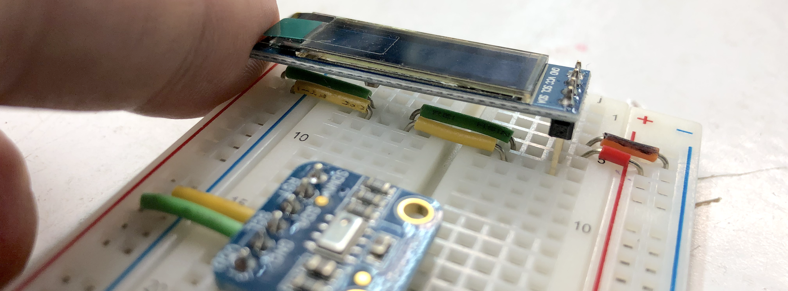

# ICE 5: End to end, publish and subscribe
Worked in a group with [Steven Yong](https://github.com/hcde440/ice-5-steven-yong) who has the publish code. I have the subscribe code.

We are using the following topic for the MQTT server:
1. Treasure/Fluke

## Libraries required for subscribing 
1. Adafruit GFX library by Adafruit
2. Adafruit SSD1306 by Adafruit
3. PubSubClient by Nick O'Leary

## Download Client
Download the [MQTT Client](http://mqttfx.jensd.de) to monitor MQTT connections. 

## Schematic
### OLED Display
